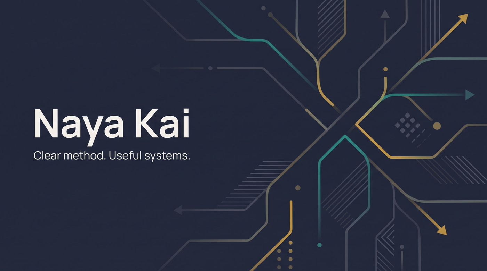

  

# Naya Kai

Enabling decisions. Working systems.

Avnish Manraj · Sydney, Australia

---

## Who is Naya Kai

Naya Kai is the name I work under. It is a deliberate cross-cultural pairing rather than a literal translation. **Naya** comes from the Sanskrit root *nī* — "to lead, to guide" — the same root that gives *netā*, "leader". It carries the sense of method, reasoning and sound judgement: the considered path. **Kai** evokes meeting, connection and shared practice — the work done with people. Read together, they mean *clear method, applied in practice*: frame the problem properly, follow the evidence, and build something a team can actually use. That is the work behind the tagline — enabling decisions, and building working systems.

The name also holds a quiet personal layer, but publicly it is simply a compact, credible technical identity. It is pronounced *NAY-ah KYE*.

---

## What I do

I work with asset-intensive organisations to turn complex data and AI capability into decisions, systems and measurable progress. That spans strategy through to hands-on build: framing the problem, obtaining and preparing the data, designing the architecture, and delivering the pipelines, models and reporting that make it real. The process is as important as the outcome — decisions are only defensible when the path to them is auditable, and the systems I build let clients keep making those decisions long after the engagement ends.

I work in short delivery cycles with Scrum where it adds value, and I keep governance visible from the start. Decisions are evidence-led, documentation stays lean and useful, and handover is designed so teams can operate what gets built.

| Focus area | What I bring |
| :-- | :-- |
| **Data & Analytics Platforms** | Modern lakehouse design, semantic modelling, pipelines and reporting foundations built for operational use. |
| **Agentic AI & LLM Systems** | Practical AI workflows, retrieval patterns and delivery guardrails for useful automation. |
| **Security, Governance & Assurance** | Zero-trust thinking, data controls, access discipline and evidence-led oversight. |
| **Delivery & Ways of Working** | Agile and Scrum practice, clear ownership, transparent status and steady delivery cadence. |

---

## Industry and Sector Experience

More than twelve years delivering for federal and state government agencies and private sector clients. Those clients are almost always asset-intensive organisations, where data quality, safety obligations and regulatory scrutiny shape every decision.

| Sector | Context |
| :-- | :-- |
| **Defence & National Security** | Federal government programmes, including Army HQ and RAAF maintenance and data management initiatives. |
| **Transport & Rail** | State transport agencies, regional rail enabling works and major network programmes. |
| **Water** | State and metropolitan water utilities, including regulatory expenditure and leakage performance. |
| **Energy & Resources** | Renewable energy operators, electricity transmission, oil & gas and mining. |
| **Government & Education** | State departments and education infrastructure portfolios. |
| **Healthcare & Telecommunications** | Hospital infrastructure asset programmes and major telco engineering data initiatives. |

---

## Technical Snapshot

Skills are mapped to [SFIA 9](https://sfia-online.org/en/sfia-9/skills) so the level of responsibility is explicit. Level 4 — *enable*; Level 5 — *ensure, advise*; Level 6 — *initiate, influence*.

| Skill | SFIA 9 | Level | In practice |
| :-- | :-- | :--: | :-- |
| Data management | DATM | 6 | Data strategy, governance frameworks and retention policy for Defence and utility clients. |
| Data engineering | DENG | 5 | Lakehouse pipelines on Microsoft Fabric and Databricks; SAP, Maximo and ArcGIS integration. |
| Data analytics | DAAN | 5 | Decision-support analytics for capital and expenditure prioritisation. |
| Data modelling and design | DTAN | 5 | Semantic models and integrated data models across disparate enterprise sources. |
| Data visualisation | VISL | 5 | 50+ Power BI products for executive, programme and operational reporting. |
| Business intelligence | BINT | 5 | Enterprise reporting platforms and automated dashboard production. |
| Solution architecture | ARCH | 5 | Cloud and data platform architecture for regulated, safety-critical environments. |
| Information assurance | INAS | 5 | ISO 27001 and government security requirements; data classification frameworks. |
| Governance | GOVN | 5 | Data governance, information management standards and delivery assurance. |
| Consultancy | CNSL | 5 | Technical due diligence, roadmap reviews and independent advisory. |
| Specialist advice | TECH | 5 | Subject matter expert for data architecture, cybersecurity and information governance. |
| Delivery management | DEMG | 5 | Leading multidisciplinary data, software and reporting teams. |
| Project management | PRMG | 5 | Complex technical projects up to $2.5M with distributed stakeholder groups. |
| Stakeholder relationship management | RLMT | 5 | Executive, contractor and multi-agency engagement across government and industry. |
| Asset management | ASMG | 5 | Asset registers, maintenance KPIs and lifecycle data for asset-intensive clients. |
| Machine learning | MLNG | 4 | Automated extraction from engineering drawings; practical LLM and agentic workflows. |

| Area | Tools and practices |
| :-- | :-- |
| **Platforms** | Microsoft Fabric, Databricks, Delta Lake, Azure |
| **Languages** | Python, SQL, PySpark, Polars |
| **BI** | Power BI, DAX, TMDL |
| **Data engineering** | dbt, modelling, pipelines, notebook-based delivery |
| **AI** | Agentic AI systems, LLM workflows, practical automation |
| **Governance** | Zero-trust governance, access controls, delivery assurance |
| **Enterprise systems** | Oracle, SAP, Maximo, Salesforce integration contexts |

---

## Education and Credentials

### Formal education

| Qualification | Institution | Year |
| :-- | :-- | :-- |
| Master of Cyber Security Operations | University of New South Wales, Canberra | 2026 |
| Graduate Certificate in Business Management | Indiana University, USA | 2016 |
| Bachelor of Software Engineering (Honours) | Monash University | 2012 |

### Certifications

| Certification | Issuer | Issued |
| :-- | :-- | :-- |
| Ethical AI | RMIT | 2026 |
| Microsoft Certified: Azure Data Fundamentals | Microsoft | 2022 |
| Professional Agile Leadership I (PAL I) | Scrum.org | 2020 |
| Professional Scrum Master I (PSM I) | Scrum.org | 2020 |
| Professional Scrum Product Owner I (PSPO I) | Scrum.org | 2020 |
| Certified Associate in Asset Management (CAAM) | Asset Management Council | 2019 |

---

## Contact

- Email: `naya.kai@pm.me`
- Location: Sydney, Australia
